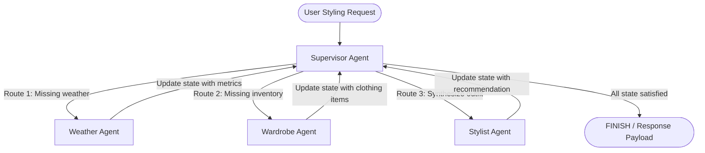
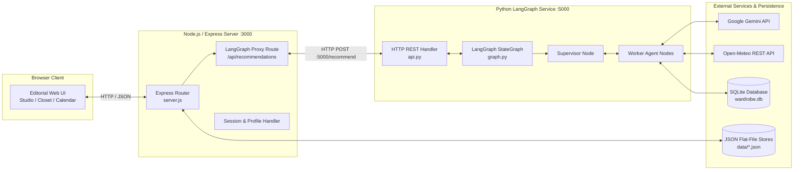

# Moda

> An AI-powered digital wardrobe and multi-agent styling platform that curates cohesive, weather-appropriate outfits strictly from clothes you actually own.

Moda addresses the everyday problem of "a closet full of clothes, but nothing to wear." While standard LLM chatbots often invent or hallucinate non-existent garments, Moda grounds every suggestion in a personal digital wardrobe database. 

The core intelligence is powered by a **LangGraph multi-agent architecture** running on Python with **Google Gemini** and **Open-Meteo REST APIs**, bridged seamlessly to a responsive **Node.js/Express** editorial web application.

---

## ✨ Features

* **Multi-Agent Outfit Curation**: LangGraph state machine orchestrates specialized agents to deliver structured outfit recommendations with transparent reasoning traces.
* **Hallucination-Free Grounding**: Outfit selections are strictly constrained to items verified in the user's SQLite wardrobe inventory (`wardrobe.db`).
* **Real-Time Weather Intelligence**: Live atmospheric metrics (temperature, precipitation probability, wind speed) dynamically filter suitable garment layers.
* **Stylist Rationale**: Clear explanations detailing why specific pieces, colors, and layers were combined for the requested occasion and forecast.
* **Digital Closet Management**: Organize, tag, and filter personal garments by category, subcategory, color, formality, and temperature comfort range.
* **Interactive Outfit Studio**: Visual canvas to preview outfit coordinates, swap individual pieces, and review agent execution steps.
* **Multi-Dimensional Inspiration Lookbook**: Curated editorial lookbooks across color stories, color combinations, and fashion aesthetics with intelligent "Build This Look" matching.
* **Wardrobe Gap Analysis**: Automatically identifies missing wardrobe pieces when comparing personal inventory against inspiration boards.
* **Outfit Calendar & Planner**: Schedule and plan daily outfits in advance on an interactive monthly and weekly calendar.
* **"My Looks" Saved Outfits**: Visual scrapbook to save, revisit, or directly load favorite outfits back into the Studio or Calendar.
* **Style DNA Diagnostic**: Interactive quiz analyzing individual aesthetic archetypes, color palettes, and fit preferences.

---

## 🤖 Multi-Agent AI Architecture

Moda coordinates reasoning across three specialized worker agents using a centralized **Supervisor Agent** built with **LangGraph**:



### Agent Responsibilities

| Agent | Responsibility | Tools & Data Sources |
| :--- | :--- | :--- |
| **Supervisor Agent** | Inspects the shared `AgentState` dictionary and dynamically determines the next transition step until reaching `FINISH`. | State conditional routing |
| **Weather Agent** | Extracts city location and retrieves real-time weather metrics (temperature, precipitation chance, conditions). | Open-Meteo REST API (`tools/weather.py`) |
| **Wardrobe Agent** | Queries and filters the user's closet inventory matching formality, category, and temperature boundaries. | SQLite database query tool (`tools/wardrobe.py`) |
| **Stylist Agent** | Reasons over user intent, live weather constraints, and available items to compose a cohesive outfit and rationale. | Google Gemini LLM (`agents/stylist_agent.py`) |

---

## 🔄 How It Works

1. **Request Intake**: The user submits a styling prompt (e.g., *"casual coffee meeting, rainy weather"*) via the Outfit Studio.
2. **Supervisor Assessment**: The Supervisor inspects `AgentState` and detects unpopulated weather data, routing execution to the **Weather Agent**.
3. **Weather Retrieval**: The Weather Agent queries the Open-Meteo REST API for live conditions in the target location (e.g., 26°C, 78% rain probability).
4. **Inventory Retrieval**: The Supervisor routes to the **Wardrobe Agent**, which queries `wardrobe.db` to retrieve items comfortable within the current temperature range and formality.
5. **LLM Synthesis**: The Supervisor invokes the **Stylist Agent**. Google Gemini evaluates the clothing items against the weather forecast and user intent, selecting a top, bottom, outerwear layer, shoes, and accessory.
6. **Parsing & DB Binding**: The Python backend cleans any Markdown artifacts from the LLM output, verifies item IDs against the database, and returns structured JSON to the Node.js layer.
7. **Frontend Presentation**: The Studio renders the outfit cards, styling rationale, and the step-by-step agent execution trace.

---

## 🏗️ System Architecture



---

## 🛠️ Tech Stack

| Category | Technologies |
| :--- | :--- |
| **Frontend** | HTML5, Vanilla JavaScript, Tailwind CSS utility classes, Google Fonts (*Bodoni Moda*, *Cormorant Garamond*, *Jost*, *Caveat*) |
| **Web Server** | Node.js, Express.js, Multer, Body-Parser, CORS |
| **AI / Agent Framework** | Python 3.12, LangGraph, LangChain Core |
| **LLM Models** | Google Gemini (`gemini-2.5-flash` via `langchain-google-genai` and `@google/genai`) |
| **Databases & Storage** | SQLite (`wardrobe.db`), JSON storage (`data/users.json`, `data/wardrobe.json`, `data/planner.json`, etc.) |
| **External APIs** | Open-Meteo REST API (Live weather metrics), Pexels API (Lookbook curation) |
| **Testing** | Pytest, Python `unittest` |
| **Build & Tooling** | Vite (frontend development), Python virtual environments (`venv`) |

---

## 📁 Project Structure

```text
Moda/
├── agents/                     # LangGraph Agent implementations
│   ├── stylist_agent.py        # Gemini reasoning agent for outfit synthesis
│   ├── wardrobe_agent.py       # Inventory filtering agent
│   └── weather_agent.py        # Open-Meteo weather agent
├── tools/                      # Tool definitions invoked by agents
│   ├── wardrobe.py             # SQLite parameterized query interface
│   └── weather.py              # Open-Meteo geocoding and forecast fetcher
├── tests/                      # Automated test suite
│   ├── test_api.py             # API endpoint and Markdown parsing tests
│   ├── test_graph.py           # LangGraph orchestration state machine tests
│   ├── test_stylist_agent.py   # Stylist agent unit tests
│   ├── test_wardrobe_agent.py  # Wardrobe agent unit tests
│   ├── test_wardrobe_tool.py   # Database query tool tests
│   ├── test_weather_agent.py   # Weather agent unit tests
│   └── test_weather_tool.py    # Open-Meteo REST integration tests
├── data/                       # Local JSON stores for user profiles, wardrobe, looks
├── public/                     # Static assets and lookbook resources
├── api.py                      # Python HTTP REST API server (Port 5000)
├── graph.py                    # LangGraph StateGraph & Supervisor logic
├── server.js                   # Node.js/Express web server (Port 3000)
├── setup_db.py                 # SQLite wardrobe database initialisation script
├── test_env.py                 # Environment and dependency verification script
├── requirements.txt            # Python dependencies
├── package.json                # Node.js dependencies and scripts
└── .env.example                # Sample environment variables template
```

---

## 🚀 Getting Started

### Prerequisites

* **Python**: 3.10 to 3.12
* **Node.js**: v18 or later
* **Google Gemini API Key**: Obtainable free from [Google AI Studio](https://aistudio.google.com/)

### 1. Clone the Repository

```bash
git clone https://github.com/Aashi0105/Moda.git
cd Moda
```

### 2. Python Environment Setup

Create and activate a virtual environment, then install Python dependencies:

**Windows (PowerShell):**
```powershell
python -m venv venv
.\venv\Scripts\Activate.ps1
pip install -r requirements.txt
```

**macOS / Linux:**
```bash
python3 -m venv venv
source venv/bin/activate
pip install -r requirements.txt
```

### 3. Node.js Setup

Install frontend and server dependencies:

```bash
npm install
```

### 4. Database Setup

Initialize the local SQLite database. This creates `wardrobe.db` seeded with demo wardrobe items:

```bash
python setup_db.py
```

> **Note**: `wardrobe.db` is intentionally excluded from Git. Running `python setup_db.py` deterministically generates the database locally.

### 5. Environment Variables

Copy the example environment template and add your API credentials:

```bash
cp .env.example .env
```

Open `.env` and set your Google Gemini API key:
```env
GEMINI_API_KEY=your_gemini_api_key_here
GOOGLE_API_KEY=your_gemini_api_key_here
```
*(Pexels, Unsplash, and Remove.bg keys are optional for extended lookbook and image features).*

### 6. Verify Environment

Run the automated diagnostic check to ensure all dependencies and credentials are functioning:

```bash
python test_env.py
```

### 7. Running the Application

Start both the Python LangGraph backend and the Node.js web server:

**Terminal 1 — Python LangGraph REST API:**
```bash
python api.py
```
*API runs at `http://localhost:5000/recommend`*

**Terminal 2 — Node.js / Express Web Server:**
```bash
node server.js
```
*Web application runs at `http://localhost:3000`*

Open `http://localhost:3000` in your browser.

---

## 🧪 Testing

The repository contains an automated test suite covering tools, agents, graph routing, and API handlers.

Run the test suite with `pytest`:

```bash
python -m pytest tests/
```

### Verified Test Suite Result

```text
tests/test_api.py ................. Passed
tests/test_app.py ................. Passed
tests/test_graph.py ............... Passed
tests/test_stylist_agent.py ....... Passed
tests/test_wardrobe_agent.py ...... Passed
tests/test_wardrobe_tool.py ....... Passed
tests/test_weather_agent.py ....... Passed
tests/test_weather_tool.py ........ Passed

======================= 15 passed in 19.60s =======================
```

### Test Coverage Highlights

* **Tools**: Parameterized SQL queries, category/formality filtering, Open-Meteo HTTP responses.
* **Agents**: Isolated agent tool execution, input validation, handling empty search results.
* **State Machine**: Full LangGraph supervisor routing through `Weather → Wardrobe → Stylist → FINISH`.
* **API & Parsing**: Markdown symbol stripping (`*`, `_`, `` ` ``), database ID binding, and HTTP serialization.

---

## 🔐 Security & Privacy

* **Secrets Management**: `.env` is excluded via `.gitignore`. API keys and credentials are never checked into version control.
* **Clean Template**: `.env.example` contains only descriptive placeholders without real credentials.
* **Runtime Uploads Ignored**: `public/uploads/*` is excluded (with `.gitkeep` maintained) to prevent personal garment photos or avatars from being tracked.
* **Sanitized Demo Data**: Flat-file JSON databases (`data/*.json`) use generic demo accounts (`demo@threadtheory.io`) with salted PBKDF2 password hashes.
* **Local Databases**: SQLite database files (`*.db`, `*.sqlite3`) are ignored to avoid committing mutated local runtime state.

---

## 🧠 Technical Highlights

* **Supervisor Routing Pattern**: Uses a dedicated supervisor node that evaluates state gaps dynamically rather than relying on a brittle static prompt chain.
* **Separation of Concerns**: Decouples weather fetching (REST tool), wardrobe querying (SQL tool), and styling logic (LLM) into isolated, independently testable units.
* **Resilient Markdown Parsing**: Cleans formatting variations from LLM outputs using regular expressions before querying the database, preventing `null` foreign key bindings.
* **Dual-Tier Query Fallback**: Incorporates deterministic fast-path query routing for standard requests to minimize latency and conserve LLM API quotas.
* **Defensive Error Handling**: Express backend includes timeout controllers and fallback handlers so network interruptions or API limits never crash the client UI.

---

## 📊 Example Recommendation

### Request Payload

```json
POST /recommend HTTP/1.1
Host: localhost:5000
Content-Type: application/json

{
  "prompt": "casual coffee meeting, rainy weather",
  "city": "Vadodara"
}
```

### Structured Response

```json
{
  "success": true,
  "top": {
    "id": 7,
    "name": "Graphic Vintage Tee"
  },
  "bottom": {
    "id": 9,
    "name": "Dark Wash Slim Jeans"
  },
  "outerwear": {
    "id": 3,
    "name": "Beige Lightweight Windbreaker"
  },
  "shoes": {
    "id": 14,
    "name": "Minimalist White Leather Sneakers"
  },
  "weather": {
    "city": "Vadodara",
    "temperature": 26.6,
    "condition": "Partly Cloudy",
    "rain_probability": 78,
    "wind_speed": 6.5
  },
  "recommended_outfit": {
    "top": { "id": 7, "name": "Graphic Vintage Tee" },
    "bottom": { "id": 9, "name": "Dark Wash Slim Jeans" },
    "outerwear": { "id": 3, "name": "Beige Lightweight Windbreaker" },
    "shoes": { "id": 14, "name": "Minimalist White Leather Sneakers" },
    "accessories": "UV Protection Sunglasses"
  },
  "full_recommendation": "### 👔 Recommended Outfit\n- **Top:** Graphic Vintage Tee\n- **Bottom:** Dark Wash Slim Jeans\n- **Outerwear:** Beige Lightweight Windbreaker\n- **Shoes:** Minimalist White Leather Sneakers\n- **Accessories:** UV Protection Sunglasses\n\n### 💡 Stylist Rationale\nThis outfit balances your styling request for casual coffee meeting, rainy weather in Vadodara with real-time weather in Vadodara (26.6°C, Partly Cloudy, 78% rain probability). The selected layers ensure comfort and color harmony.",
  "execution_trace": [
    "Supervisor ➔ Weather Agent",
    "Weather Agent Executed",
    "Supervisor ➔ Wardrobe Agent",
    "Wardrobe Agent Executed",
    "Supervisor ➔ Stylist Agent",
    "Stylist Agent Executed",
    "Supervisor ➔ FINISH"
  ],
  "retrieved_wardrobe_count": 6
}
```

---

## 🧩 Challenges & Engineering Decisions

* **Overcoming LLM Hallucinations**: Prompting an LLM to recommend clothing often leads to fictional garments. We addressed this by implementing parameterized SQL retrieval where only verified garment IDs are provided to the model, ensuring recommendations are 100% wearable.
* **Decoupled Architecture**: Rather than maintaining a monolithic Python app, we divided responsibilities between an Express server (specialized in static asset serving, session handling, and file uploads) and a Python microservice (specialized in LangGraph state machines and LLM integrations).
* **LLM Markdown Sanitization**: Gemini occasionally returned item names wrapped in bold asterisks (e.g. `**Beige Lightweight Windbreaker**`). A sanitization layer was built into `api.py` to strip Markdown artifacts before database lookup, ensuring foreign keys resolve accurately.
* **Graceful Degradation**: To prevent UI freezes if external APIs experience latency or rate limits, the system features configurable timeouts and rule-based fallback engines.

---

## 🔮 Future Improvements

* [ ] **Multi-User Wardrobe DBs**: Migrate SQLite to PostgreSQL for multi-tenant wardrobe inventory isolation in production deployments.
* [ ] **Computer Vision Tagging**: Implement automatic garment categorization, color extraction, and season detection using Gemini Vision on upload.
* [ ] **Vector Similarity Search**: Add semantic embeddings (e.g., ChromaDB) for aesthetic style matching beyond categorical queries.
* [ ] **Calendar Export**: Enable iCal / Google Calendar sync for scheduled outfits.

---

## 👩‍💻 Author

**Aashi Vora**  
* GitHub: [https://github.com/Aashi0105](https://github.com/Aashi0105)
